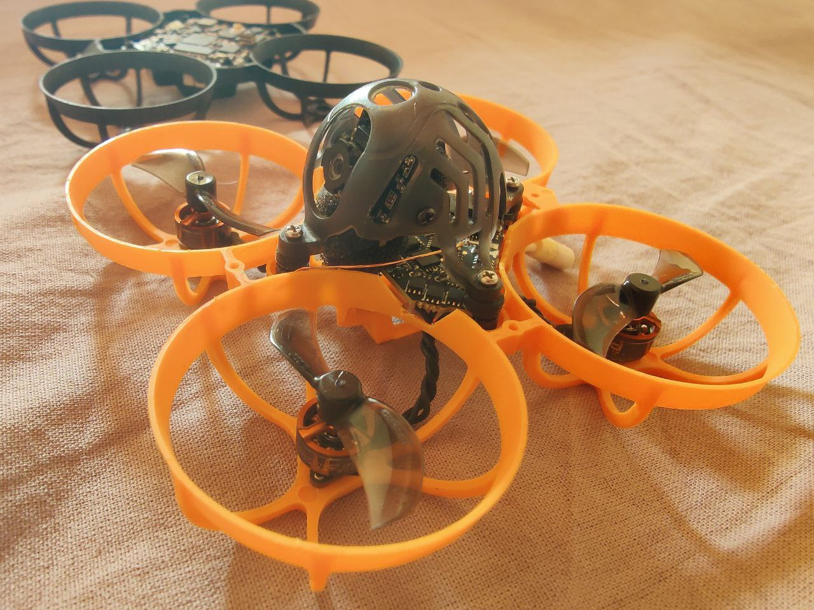

---
categories:
  - mobeetl6
  - diamondf4
date: 2024-06-04
---
# Сетапы мобитла6 от казахстанских пилотов

* Diamond F4
* rcinpower 0802 (0702/0703)
* meteor65 air рама
* gemfan 1219s
* камера foxeer razer pico 4:3 **[тут](https://aliexpress.ru/item/1005001620043911.html)**
* tattu 300

Альтернативный мотор

Мотор для FPV квадрокоптера Spark 0702 1S 25000kv 4шт VCI
https://global.wildberries.ru/product?card=178776947

Из коробки сейчас Даймонды плохо работают. Но после небольших настроек - идеально всё становится

1. Частота пид лупа нужно ставить 3.2кГц
2. Регули шить блюджеем таргетом O_H_15 на 96кГц

Так же можно поставить на раму метеор65 про с 35 пропами

Авторы: Алексей Щепа, Владимир Токарев