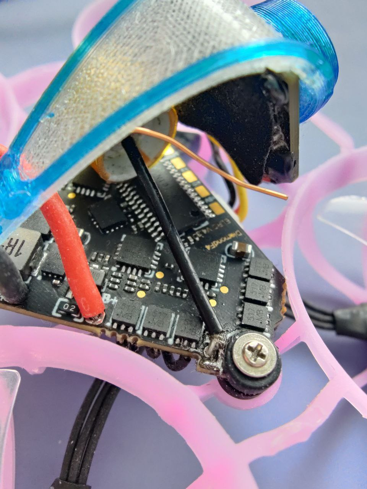

---
categories:
  - mobeetl6
  - diamondf4
  - доработки
date: 2024-06-04
---
# Замена мосфетов на новых полетниках Diamond F4

Счастливым обладателям mobeetle6, купленных в этом году, у кого при прошивке регулей на 96гц дрон греется, есть решение.

Нужно менять мосфеты на оригинальные с маркировкой EEW. После замены у меня на 96гц максимальный нагрев 52° и время полета 5:40 вместо 4 минут.

Заказать можно **[тут](https://sl.aliexpress.ru/p?key=CNuAsun)**

Маркировка после EEW может отличаться - это нормер партии или дата выпуска

Автор: **[Pavel Gavrilov](https://t.me/reeson2003)**